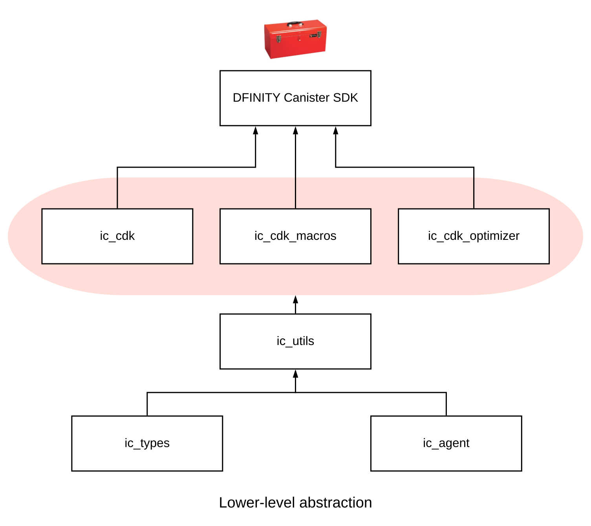

# Introduction to the Rust canister development kit (cdk-rs)

Rust is a powerful and type sound modern programming language with an active developer community.
Because Rust compiles to WebAssembly, it offers a rich development environment for writing applications to run on the Internet Computer.
To help pave the way for writing applications in Rust that can be deployed on the Internet Computer, DFINITY provides some tools to simplify the process.

Collectively, these tools are referred to as the DFINITY Canister Development Kit (CDK) for Rust and consist of the following main libraries:

|Package |Description |
|------- |----------- |
|`ic-types` |The `ic-types` crate defines the types used to communicate with the {IC} replica, and when building applications to be deployed as canisters on the {IC}. |
|`ic-agent` |The `ic-agent` library enables direct communication with the {IC} replica. |
|`ic-utils` |The `ic-utils` library provides utilities for managing calls and applications deployed as canisters. |
|`ic-cdk` |The `ic-cdk` provides the core methods that enable Rust programs to interact with the {IC} main system API. This library serves as the runtime core of the Rust CDK. |
|`ic-cdk-macros` |The `ic-cdk-macros` library defines the procedural macros that facilitate building operation endpoints and API. This library includes key macros for `update`, `query`, `import` and other important operations. |
|`ic-cdk-optimizer` |The `ic-cdk-optimizer` is a helper library used to reduce the size of WebAssembly modules. |

The following diagram provides a simplified view of the Rust Canister Development Kit (CDK) building blocks from the lowest to highest level of abstraction.

